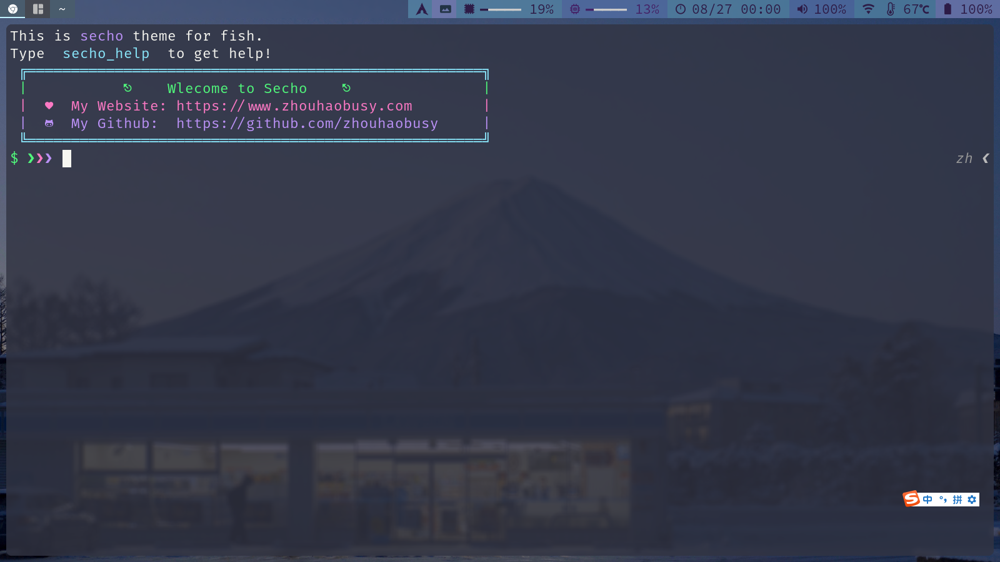

# Secho theme
> Secho 是一个基于fish shell 轻量化的主题

它拥有简洁的主题样式，丰富的功能函数

Several commands are provided to interact with this directory history:

dirh prints the history
cdh displays a prompt to quickly navigate the history
prevd moves backward through the history. It is bound to Alt+←
nextd moves forward through the history. It is bound to Alt+→

